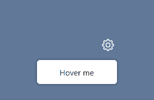

<p align="center">
    
</p>
<h1 align="center">
    Svelte action to display a tooltip
</h1>

[](https://www.npmjs.com/package/@untemps/svelte-use-tooltip)
[](https://github.com/untemps/svelte-use-tooltip/actions)
[](https://codecov.io/gh/untemps/svelte-use-tooltip)

## Demo

<p align="center">
    :red_circle:&nbsp; <big><a href="https://svelte-use-tooltip.vercel.app" target="_blank" rel="noopener">LIVE DEMO</a></big> &nbsp;:red_circle:
</p>

## Installation

```bash
npm i @untemps/svelte-use-tooltip
```

## Usage

### Basic usage

```svelte
<script>
	import { useTooltip } from '@untemps/svelte-use-tooltip'

	const _onTooltipClick = (arg, event) => {
		console.log(arg, event)
	}
</script>

<div
        use:useTooltip={{
        position: 'right',
        contentSelector: '#tooltip-template',
        contentActions: {
            '*': {
                eventType: 'click',
                callback: _onTooltipClick,
                callbackParams: ['ok'],
                closeOnCallback: true,
            },
        },
        containerClassName: `tooltip tooltip-right`,
        animated: true,
        animationEnterClassName: 'tooltip-enter',
        animationLeaveClassName: null,
        enterDelay: 100,
        leaveDelay: 100,
        offset: 20
	}}
        class="target"
>
    Hover me
</div>
<template id="tooltip-template">
    <span class="tooltip__content">Hi! I'm a <i>fancy</i> <strong>tooltip</strong>!</span>
</template>

<style>
    .target {
        width: 10rem;
        height: 3rem;
        background-color: white;
        color: black;
        display: flex;
        align-items: center;
        justify-content: center;
        box-shadow: 0 0 5px 0 rgba(0, 0, 0, 0.5);
    }

    .target:hover {
        cursor: pointer;
        background-color: black;
        color: white;
    }

    .tooltip__content {
        background-color: yellow;
        color: black;
    }

    :global(.tooltip) {
        position: absolute;
        z-index: 9999;
        max-width: 120px;
        background-color: #ee7008;
        color: #fff;
        text-align: center;
        border-radius: 6px;
        padding: 0.5rem;
    }

    :global(.tooltip::after) {
        content: '';
        position: absolute;
        margin-left: -5px;
        border-width: 5px;
        border-style: solid;
    }

    :global(.tooltip-right::after) {
        top: calc(50% - 5px);
        left: -5px;
        border-color: transparent #ee7008 transparent transparent;
    }

    :global(.tooltip-enter) {
        animation: fadeIn 0.2s linear forwards;
    }

    @keyframes fadeIn {
        from {
            opacity: 0;
            transform: translateX(50px);
        }
        to {
            opacity: 1;
            transform: translateX(0);
        }
    }
    @keyframes fadeOut {
        to {
            opacity: 0;
            transform: translateX(-50px);
        }
    }
</style>
```

## API

| Props                     | Type    | Default           | Description                                                                     |
|---------------------------|---------|-------------------|---------------------------------------------------------------------------------|
| `content`                 | string  | null              | Text content to display in the tooltip.                                         |
| `contentSelector`         | string  | null              | Selector of the content to display in the tooltip.                              |
| `contentActions`          | object  | null              | Configuration of the tooltip actions (see [Content Actions](#content-actions)). |
| `containerClassName`      | string  | '__tooltip'       | Class name to apply to the tooltip container.                                   |
| `position`                | string  | 'top'             | Position of the tooltip. Available values: 'top', 'bottom', 'left', 'right'     |
| `animated`                | boolean | false             | Flag to animate tooltip transitions.                                            |
| `animationEnterClassName` | string  | '__tooltip-enter' | Class name to apply to the tooltip enter transition.                            |
| `animationLeaveClassName` | string  | '__tooltip-leave' | Class name to apply to the tooltip leave transition.                            |
| `enterDelay`              | number  | 0                 | Delay before showing the tooltip in milliseconds.                               |
| `leaveDelay`              | number  | 0                 | Delay before hiding the tooltip in milliseconds.                                |
| `onEnter`                 | func    | null              | Callback triggered when the tooltip appears.                                    |
| `onLeave`                 | func    | null              | Callback triggered when the tooltip disappears.                                    |
| `offset`                  | number  | 10                | Distance between the tooltip and the target in pixels.                          |
| `disabled`                | boolean | false             | Flag to disable the tooltip content.                                            |

### Content and Content Selector

The tooltip content can be specified either by the `content` prop or the `contentSelector` prop.

`content` must be a text string that will be displayed as is in the tooltip.

It's useful for most of the use cases of a tooltip however sometimes you need to display some more complex content, with interactive elements or formatted text.  

To do so, you may use the `contentSelector` prop that allows to specify the selector of an element from the DOM.

The best option is to use a [template](https://developer.mozilla.org/en-US/docs/Web/HTML/Element/template) HTML element although you may also use a plain element. In this case, **it will remain in the DOM and will be clones in the tooltip**.

### Content Actions

The `contentActions` prop allows to handle interactions within the tooltip content.

Each element inside the content parent may configure its own action since it can be queried using the key-selector.

One event by element is possible so far as elements are referenced by selector. The last one declared in the `contentActions` object has precedence over the previous ones.

```svelte
<script>
    import { useTooltip } from '@untemps/svelte-use-tooltip'
</script>

<div use:useTooltip={{
    contentSelector: '#content',
    contentActions: {
        '#button1': {
            eventType: 'mouseenter',
            callback: (arg) => console.log(arg),
            callbackParams: ['Haha you\'re hovering the button 1'],
            closeOnCallback: false
        },
        '#button2': {
            eventType: 'click',
            callback: (arg1, arg2) => console.log(arg1, arg2),
            callbackParams: ['Haha you\'ve clicked the', 'button 2'],
            closeOnCallback: true
        },
    }
}}>Hover me</div>
<span id="content">
    <button id="button1">Action 1</button>
    <button id="button2">Action 2</button>
</span>
```

| Props             | Type     | Default | Description                                                                                              |
| ----------------- | -------- | ------- | -------------------------------------------------------------------------------------------------------- |
| `eventType`       | string   | null    | Type of the event. All available [events](https://developer.mozilla.org/fr/docs/Web/Events) can be used. |
| `callback`        | function | null    | Function to be used as event handler.                                                                    |
| `callbackParams`  | array    | null    | List of arguments to pass to the event handler in.                                                       |
| `closeOnCallback` | boolean  | false   | Flag to automatically close the tooltip when the event handler is triggered.                             |

#### `*` selector

If you need the whole tooltip content to be interactive, you can use the special `*` key:

```svelte
<script>
    import { useTooltip } from '@untemps/svelte-use-tooltip'
</script>

<div use:useTooltip={{
    content: 'Foo',
    contentActions: {
        '*': {
            eventType: 'click',
            callback: (arg) => console.log(arg),
            callbackParams: ['Haha you clicked the tooltip'],
            closeOnCallback: true
        }
    }
}}>Hover me</div>
```

If you combine the `*` selector with other events, its callback will be triggered along with the other ones.

## Development

The component can be served for development purpose on `http://localhost:5000/` running:

```bash
npm run dev
```

## Contributing

Contributions are warmly welcomed:

-   Fork the repository
-   Create a feature branch
-   Develop the feature AND write the tests (or write the tests AND develop the feature)
-   Commit your changes
    using [Angular Git Commit Guidelines](https://github.com/angular/angular.js/blob/master/DEVELOPERS.md#-git-commit-guidelines)
-   Submit a Pull Request
