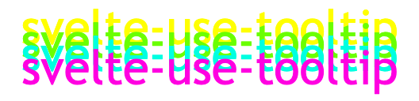

<p align="center">
    
</p>
<p align="center">
    Svelte action to display a tooltip
</p>

---

[](https://www.npmjs.com/package/@untemps/svelte-use-tooltip)
[](https://github.com/untemps/svelte-use-tooltip/actions)
[](https://codecov.io/gh/untemps/svelte-use-tooltip)

## Installation

```bash
yarn add @untemps/svelte-use-tooltip
```

## Usage

### Basic usage

```svelte
<script>
    import { useTooltip } from '@untemps/svelte-use-tooltip'

    const _onTooltipClick = (arg, event) => {
        console.log(arg, event)
    }
</script>

<div use:useTooltip={{
        contentSelector: '.tooltip__content',
        contentClone: false,
        contentActions: {
            '*': {
                eventType: 'click',
                callback: _onTooltipClick,
                callbackParams: ['ok'],
                closeOnCallback: true
            },
        },
        contentClassName: 'tooltip',
        disabled: false,
        animated: true
    }
} class="tooltip__target">
    Hover me
</div>
<span class="tooltip__content">Hi!</span>

<style>
    .tooltip__target {
        width: 10rem;
        height: 3rem;
        background-color: white;
        color: black;
        display: flex;
        align-items: center;
        justify-content: center;
        box-shadow: 0 0 5px 0 rgba(0,0,0,0.5);
    }

    .tooltip__target:hover {
        cursor: pointer;
        background-color: black;
        color: white;
    }

    .tooltip__content {
        border: solid 1px white;
        background: none;
    }

    :global(.tooltip) {
        position: absolute;
        z-index: 9999;
        max-width: 120px;
        background-color: #ee7008;
        color: #fff;
        text-align: center;
        border-radius: 6px;
        padding: 0.5rem;
    }

    :global(.tooltip::after) {
        content: '';
        position: absolute;
        top: 100%;
        left: 50%;
        margin-left: -5px;
        border-width: 5px;
        border-style: solid;
        border-color: #ee7008 transparent transparent transparent;
    }
</style>
```

## API

| Props                | Type    | Default | Description                                                                                                     |
| -------------------- | ------- | ------- | --------------------------------------------------------------------------------------------------------------- |
| `contentSelector`    | string  | null    | Selector of the content to display in the tooltip.                                                              |
| `contentClone`       | boolean | null    | Flag to clone the content to display in the tooltip. If false, the content is removed from its previous parent. |
| `contentActions`     | object  | null    | Configuration of the tooltip actions (see [Content Actions](#content-actions)).                                 |
| `containerClassName` | string  | null    | Class name to apply to the tooltip container.                                                                   |
| `disabled`           | boolean | false   | Flag to disable the tooltip content.                                                                            |
| `animated`           | boolean | false   | Flag to animate tooltip transitions.                                                                            |

### Content Actions

The `contentActions` prop allow handling interactions within the tooltip content.

Each element inside the content parent may configure its own action since it can be queried using the key-selector.

One event by element is possible so far as elements are referenced by selector. The last one declared in the `contentActions` object has precedence over the previous ones.

```svelte
<script>
    import { useTooltip } from '@untemps/svelte-use-tooltip'
</script>

<div use:useTooltip={{
    contentSelector: '#content',
    contentClone: false,
    contentActions: {
        '#button1': {
            eventType: 'mouseenter',
            callback: (arg) => console.log(arg),
            callbackParams: ['Haha you\'re hovering the button 1'],
            closeOnCallback: true
        },
        '#button2': {
            eventType: 'click',
            callback: (arg1, arg2) => console.log(arg1, arg2),
            callbackParams: ['Haha you\'ve clicked the', 'button 2'],
            closeOnCallback: false
        },
    }
}}>Hover me</div>
<span id="content">
    <button id="button1">Action 1</button>
    <button id="button2">Action 2</button>
</span>
```

| Props             | Type     | Default | Description                                                                                              |
| ----------------- | -------- | ------- | -------------------------------------------------------------------------------------------------------- |
| `eventType`       | string   | null    | Type of the event. All available [events](https://developer.mozilla.org/fr/docs/Web/Events) can be used. |
| `callback`        | function | null    | Function to be used as event handler.                                                                    |
| `callbackParams`  | array    | null    | List of arguments to pass to the event handler in.                                                       |
| `closeOnCallback` | boolean  | false   | Flag to automatically close the tooltip when the event handler is triggered.                             |

## Development

The component can be served for development purpose on `http://localhost:5000/` running:

```bash
yarn dev
```

## Contributing

Contributions are warmly welcomed:

-   Fork the repository
-   Create a feature branch
-   Develop the feature AND write the tests (or write the tests AND develop the feature)
-   Commit your changes
    using [Angular Git Commit Guidelines](https://github.com/angular/angular.js/blob/master/DEVELOPERS.md#-git-commit-guidelines)
-   Submit a Pull Request
